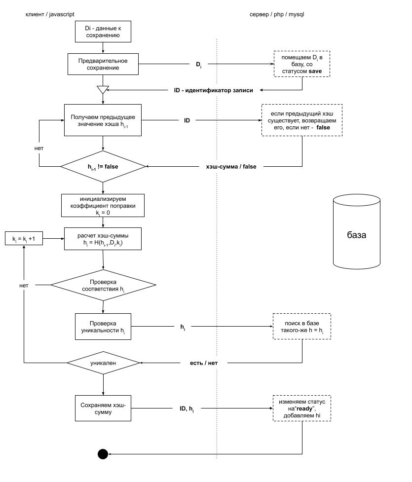

# Система управления базой данных, основанной на технологии блокчейн 
### v0.0.1 
### 1. Механизм хранения данных
---
#### Алгоритмы хэшировнаие
Файл:  `source/hash/hash.js`\
`hash(число,длина)` - алгоритм хэширования целого числа\
`massivToHash(массив,длина)` - алгоритм преобразования массива чисел в соотвествующий хэш\
`strToMassiv(строка)` - преобразование строки в массив,где каждый элемент соотвествует коду символа в строке\
`strToHash(строка,длина)` - преобразование строки в соотвествующий хэш

---
#### Поиск хеш-суммы определенного вида (майнинг)
 Файл:  `source/mine/mine.js`\
`isHashValid(хеш-сумма)` - проверка соотвествия хеш-сыммы определенному условию\
`mine(строка)` - поиск хеш-суммы определенного вида ( для которой выполнится isHashValid). Результатом 
будет объект {hash,i} hash - найденная сумма, i - приращение , при котором выполняется isHashValid

---
### 2. Блок схема сохранеия информации 

---
### 3. Интерфейса ввода и управления данными

(в разработке)

