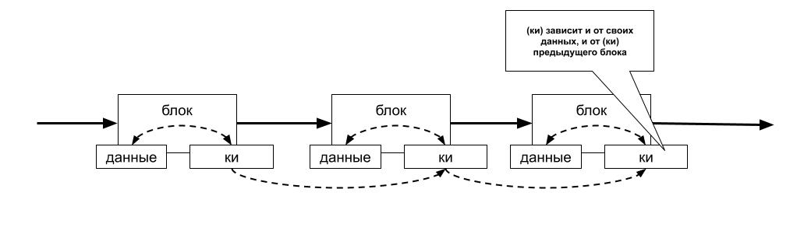
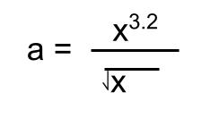
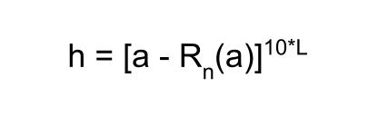
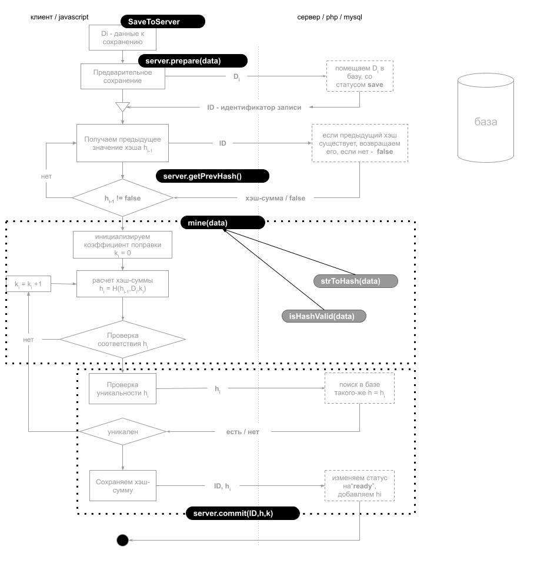

# Система управления базой данных, основанной на технологии блокчейн 
### v0.0.1
### 1. Описание технологии блокчейн (B)

В хронологических системах хранения информации существует
проблема проверки неизменности сохраненных данных. 
Пользователь отправляя информацию на хранение должен быть уверен,
что со временем информация не измениться и есть простой механизм проверки 
этого. Одним из решений данной проблемы может являться механизм блокчейна (B).

(В) представляет собой цепочку последовательных блоков данных, каждый из которых хранит 
краткую информацию (КИ) о предыдущем блоке данных, таким образом, чтобы изменить информацию
в одном блоке данных, необходимо изменить (КИ) во всех последующих. Если 
механизм проверки соответствия (КИ) будет достаточно быст и надежен,
а механизм создания (КИ) будет требователен ко времени ( не быстрый ), то получим цепочку
блоков данных на изменение, данных в одном блоке которого, потребуется полный пересчет (КИ)
во всех последующих. При большом колличестве таких блоков или чем старше хранимая информация
тем больше времени будет требоваться на ее изменение.

В оригинальной теории блокчейна для расчета (КИ) используется механизм хеширования основанный 
на элиптических кривых, описываемых уравнением Вейерштрасса.
https://habr.com/ru/company/bitfury/blog/340378/
 В данной работе для упрощения 
будем использовать более простоя метод получения хеша, основанный на взятии ряда чисел после 
запятой от вещественного числа, полученного при вычислении следующего выражения:

Выражение для вычисления хэш-суммы будет следующим:

где, Rn - операция округления к ближайшему целому, L - длина хэш-суммы 

Так же, в оригинальной теории, для увеличения времени получения хэш-суммы используется дополнительное условие к виду полученного хэша. (к примеру хэшь-суимма должна начинаться 8-ю нулями), в данной работе, для упрощения принимаем, что хэшь-сумма будет валидной если содержит миниму две цифры 2.

### 2. Механизм хранения данных
---
#### Алгоритмы хэшировнаие
Файл:  `source/hash/hash.js`\
`hash(число,длина)` - алгоритм хэширования целого числа\
`massivToHash(массив,длина)` - алгоритм преобразования массива чисел в соотвествующий хэш\
`strToMassiv(строка)` - преобразование строки в массив,где каждый элемент соотвествует коду символа в строке\
`strToHash(строка,длина)` - преобразование строки в соотвествующий хэш

---
#### Поиск хеш-суммы определенного вида (майнинг)
 Файл:  `source/mine/mine.js`\
`isHashValid(хеш-сумма)` - проверка соотвествия хеш-сыммы определенному условию\
`mine(строка)` - поиск хеш-суммы определенного вида ( для которой выполнится isHashValid). Результатом 
будет объект {hash,i} hash - найденная сумма, i - приращение , при котором выполняется isHashValid

---
### 3. Блок схема сохранеия информации 

---
### 4. Блок схема сохранеия информации (функциональная)

---
### 5. Интерфейса ввода и управления данными

